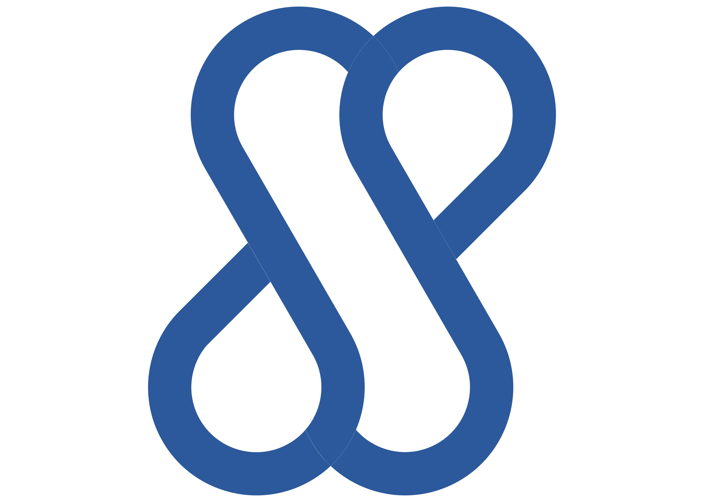
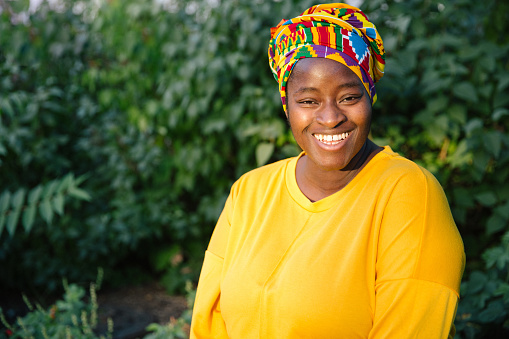
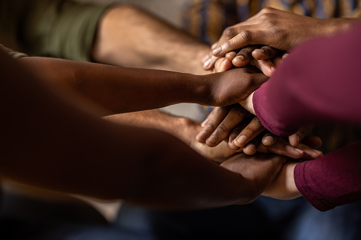

# SafeSpace
<br />

<p align="center">

</p>
SafeSpace is a web application designed to help young adults and adolescents navigate mental distress. The app will provide tools, exercises, resources and a community to help alleviate mental distress. The initial version of the SafeSpace app will allow people to sign up, download the app and access channels and rooms to meet people in real-time. Future versions will include a guided journaling feature and an emotional assessment tool.
According to the World Health Organization, about 450 million have a mental disorder, and 25% of people will have a mental illness. SafeSpace helps to solve this problem by providing tools to help alleviate distress as a result of mental stress and illness.

SafeSpace is targeting:
Young adults who need to destress from life's pressure.
Adolescents who don’t know how to manage mental distress effectively.
People with mental illnesses.
People who want to take care of their emotional wellness.
<p align="center"> 
  


<p>
  
### How to run the app locally 
```
clone the repository 
run "pip install -r requirements.txt"
run "python -m flask run"
```

